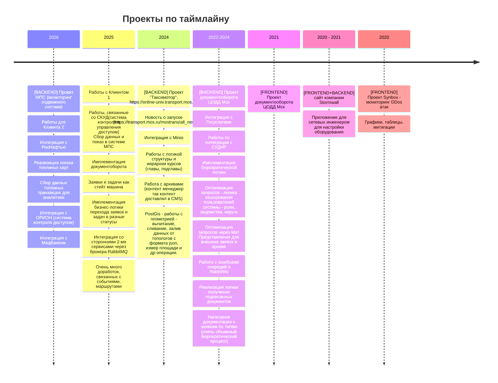

# Инженер разработки

## Айнур Шауэрман

* [Таймлайн трудовой деятельности](#таймлайн-трудовой-деятельности)
* [Высшее образование](#высшее-образование)
* [Ожидание от работодателя](#ожидание-от-работодателя)
* [Семейное положение](#семейное-положение)
* [Личные качества](#личные-качества)

Проекты, в которых я приложила свои умения:

## Таймлайн трудовой деятельности
**2026**  ООО «СтандартПроект» [https://stdpr.ru/](https://stdpr.ru/)
**[BACKEND] Проект МПС (мониторинг подвижного состава)**
*Стек*: Ruby, RoR, RabbitMq, GraphQL, PostgeSQL
Работы для *Клиента 2*
* Интеграция с РосНефтью
* Реализация логики топлиных карт
* Сбор данных топлиных транзакции для аналитики
* Интеграция с ОРИОН (система контроля доступом)
* Интеграция с МедБанком

**2025**

Работы с *Клиентом 1*
* Работы, связанные со СКУД(система контроля и управления доступом) Сбор данных и показ в системе МПС
* Имплементация документоборота
* Заявки и задачи как стейт машина
* Имплементация бизнес-логики перехода заявок и задач в разные статусы
* Интеграция со сторонними 2-мя сервисами через брокера RabbitMQ
* Очень много доработок, связанных с событиями, маршрутами

**2024**
**[BACKEND] Проект "Таксимотор"**, https://online-univ.transport.mos.ru/
*Стек*: Golang, RabbitMq, PostgeSQL
* Новость о запуске (https://transport.mos.ru/mostrans/all_news/120971)
* Интеграция с Minio
* Работы с логикой структуры и иерархии курсов (главы, подглавы)
* Работа с архивами (контент менеджер так контент доставлял в CMS)

**2022-2024**
**[BACKEND] Проект документооборота ЦОДД Мск**
*Стек*: Ruby, RoR, RabbitMq, PostgeSQL

* Интеграция с Госуслугами
* Работы по интеграции с СУДИР
* Имплементация бюрократической логики
* Оптиимзация запросов - логика кеширования пользователей системы - роли, ведомства, округа
* Оптимизация запросов через Мат Представления для внешних заявок в архиве
* Работа с ошибками очередей в RabbitMq
* Реализация логики получения подписанных документов
* Написание документации к заявкам по типам (очень объемный бюрократический процесс)
* PostGis - работы с геометрией - вычитание, сливание, залив данных от топологов с формата json, измер площади и др операции.

**2021**
**[FRONTEND] Проект документооборота ЦОДД Мск**
*Стек*: React, JavaScript

**2020 - 2021**
**[FRONTEND+BACKEND] Stormwall** [https://stormwall.pro/](https://stormwall.pro/)
*Стек*: React, JavaScript
* сайт компании
* Приложение для сетевых инженером для настройки оборудования

**Проект Synbox** - мониторинг DDos атак: Графики, таблицы, митигации

**2020**
**[FRONTEND] Eltex** [https://eltex.ru/](https://eltex.ru/)
**Проект Мониторинга системы для Почты России**
*Стек*: AngularJS, JavaScript

## Высшее образование

*2004-2010* - Сибирский Государственный университет телекоммуникации и информатики
[https://sibsutis.ru/](https://sibsutis.ru/)

Специальность: Радиотехника (по сути hardware разработчик)

## Ожидание от работодателя

* зп от 200 тыс руб,
* полный рабочий график в любых таймзонах России,
* удалённая работа

## Семейное положение

Трое детей: 9, 12 и 16 лет.

## Личные качества

* образованная
* любопытная